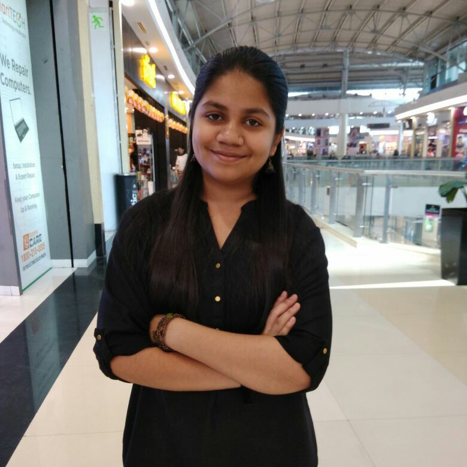

# Arya Gawde

Hello! I am Arya Gawde, a first year undergraduate student at **Indian Institute of Technology (IIT) Goa**, pursuing a BTech degree in **Computer Science and Engineering**. I am from *Mumbai, Maharashtra.*  
My hobbies include listening to various kinds of music, singing and reading books. I also enjoy playing sudoku. 

----
## Education

| Year of Graduation | Degree | Institution |
| -------- | ---------| ---------------|
| 2025 | B. Tech. | Indian Institute of Technology Goa |
| 2021 | 12th Standard (Higher Secondary Certificate (HSC)) - State Board:|  Ratanbai Walbai Junior College of Science, Mulund, Mumbai, Maharashtra |
| 2019 | 10th Standard (CBSE) | New Horizon Scholars School, Airoli, Navi Mumbai, Maharashtra. |

--------

## 1st-year Courses @ IIT Goa

### Autumn Semester

- **MTH101:** Calculus by *Dr. Sandipan De and Dr. Abhitosh Upadhyay* 
- **PH101:** Quantum Physics and Application by *Dr. Santosh Kumar Das and Dr. Sudipta Kanungo*
- **CS101:** Introduction to Computing by *Dr. Clint P. George*
- **CH101:** Physical Chemistry by *Dr. Mantu Santra and Dr. E Siva Subramaniam Iyer*
- **CH102:** Inorganic and Organic Chemistry by *Dr. Raja Mitra and 
                Rishikesh Narayan*
- **CH104:** Chemistry Lab II by *Dr. E Siva Subramaniam Iyer*
- **HS101:**Foundation Programme in Humanities and Social Sciences by *Dr. Sabiha Hashami*
- **CS100:** Introduction to Profession by  *Dr. Neha Karanjkar*
- **NO101:** National Sports Organization by *Santosh Upadhyay*

### Spring Semester 

1. *MTH1021:* Basic Linear Algebra by Dr. Kalpesh Haria
2. *PH102:* Electricity and Magnetism by  Dr. Vaibhav Wasnik and Dr. Santosh Kumar 
3. *PH104:* Physics Lab by Dr. Sudipta Kanungo
4. *EE101:* Introduction to Electrical and Electronics Engineering by Dr. Sheron Figardo and Dr. Nandakumar Nambath
5. *BIO101:* Introductory Biology by Dr. Sreenath Balakrishnan and Dr. Rishikesh Narayan
6. *ME102:* Engineering Graphics and Introduction to Computer Aided-Drawing by <u> Dr. Anirudha Ambekar
7. *NO102:* National Sports Organization by Santosh Upadhyay
8. [CS102](https://clintpgeorge.github.io/cs-102-spring-2022/) *CS102:* Software Tools by Dr. Clint P. George

<!-- None of the other spring semester courses has a webpage apart from CS102, so the link for CS102 is updated.-->

-----

## Hobbies
 My hobbies include: singing and listening to the various genres of music like: 
- English Pop and Hindi film music 
- [Jazz](https://en.wikipedia.org/wiki/Jazz) 
- [Rhythm and blues (R&B)](https://en.wikipedia.org/wiki/Rhythm_and_blues)
- Rock 

Apart from this, I also enjoying reading novels and playing sudoku. 